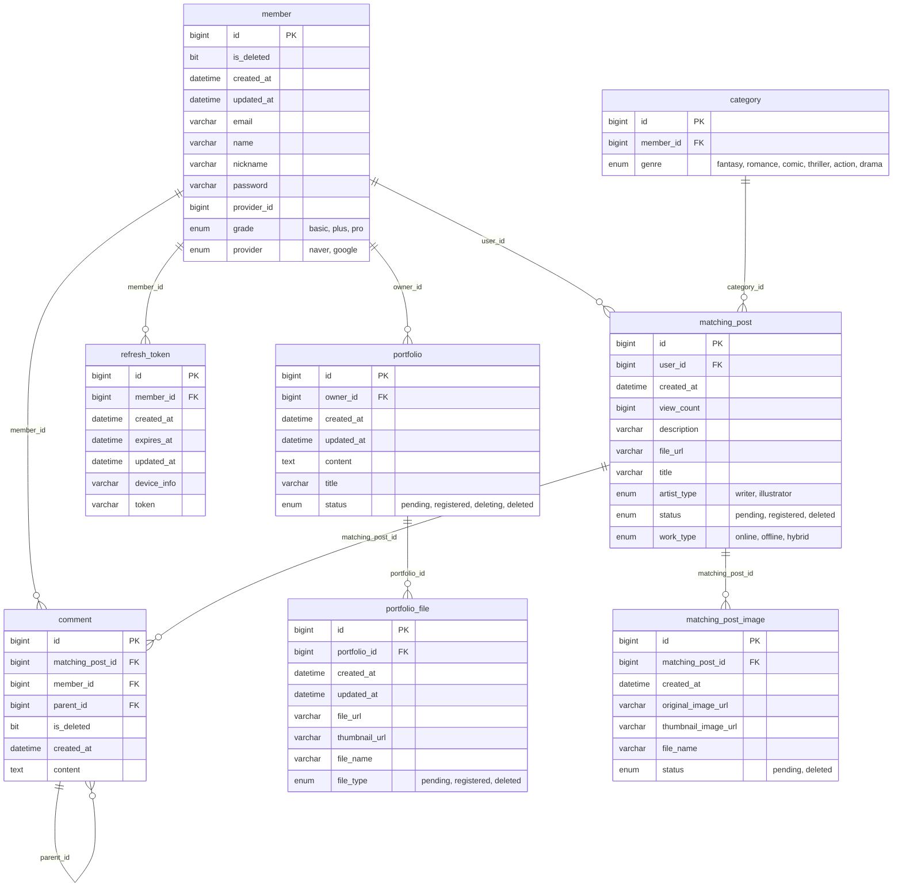
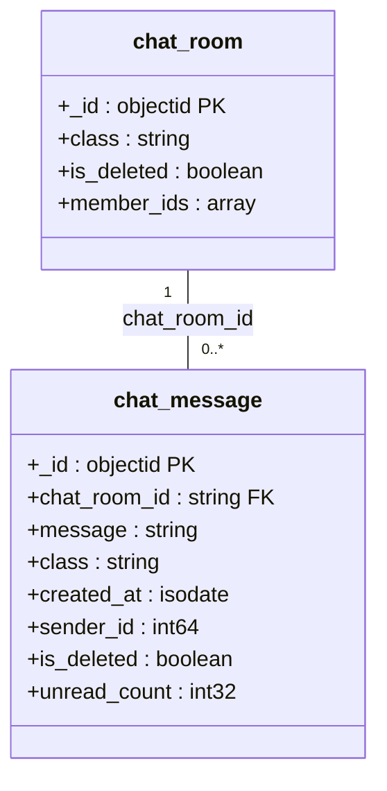
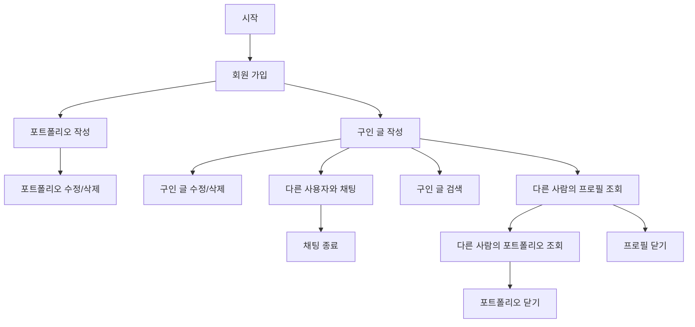

# TapToon:  𓆉𓆝 𓆟 𓆞 𓆝 𓆟𓇼 웹툰 창작의 꿈을 잇다

 

 

## ☄️ 순간이동
* [💻 프로젝트 개요](#-프로젝트-개요)
* [⚙️👷🏻‍♂️🛠️🔧 Developed by](#-developed-by)
* [⏳ 작업 기간](#-작업-기간)
* [📚 Used Stacks](#-used-stacks)
* [🔳 와이어 프레임](#-와이어-프레임)
* [🏗️ 프로젝트 구조](#-프로젝트-구조)
  * [𓊍 프로젝트 아키텍처](#𓊍-프로젝트-아키텍처)
  * [⛁ ERD (RDMBS)](#-erd-rdmbs)
  * [⛃ MongoDB Schema](#-mongodb-schema)
  * [🔁 프로젝트 플로우 개요](#-프로젝트-플로우-개요)
  * [🌀 서비스 상세 플로우 (참고)](#-서비스-상세-플로우-참고)
* [🧩 API 명세서](#-api-명세서)
* [⚡ 주요 기능](#-주요-기능)
  * [📁 포트폴리오 등록](#-포트폴리오-등록)
  * [📝 매칭 포스트 (구인 글)](#-매칭-포스트-구인-글)
  * [🗣️ 채팅](#-채팅)
* [🪵 Dev log](#-dev-log)

 

## 💻 프로젝트 개요

> 🎨✍️ **"아이디어는 있지만 그림이 어렵다면? 그림 실력은 있지만 이야기가 고민이라면?"**  
> 웹툰 작가와 글 작가가 만나 최고의 작품을 탄생시킬 수 있도록 도와주는 매칭 플랫폼을 소개합니다!
>
> ---
>
> 🔥 **어떻게 이용할 수 있나요?**
>
> 🥇 **자신을 PR하세요!**  
> 👉 **포트폴리오를 업로드**하고, 자신의 작품 스타일과 강점을 소개하세요.  
> 👉 **매칭 게시글을 작성**하여 함께할 파트너를 찾으세요.
>
> 🥈 **서로의 작품을 확인하세요!**  
> 👉 게시글을 보고 마음에 드는 작가를 찾고, 포트폴리오를 살펴보세요.  
> 👉 다양한 장르와 스타일을 가진 작가들을 한눈에 확인할 수 있습니다.
>
> 🥉 **바로 연락하고 협업을 시작하세요!**  
> 👉 **1:1 채팅 기능**을 통해 관심 있는 작가와 직접 소통하세요.  
> 👉 아이디어를 나누고, 새로운 프로젝트를 함께 시작하세요!
>
> ---
>
> 🎯 **이런 분들에게 추천합니다!**
>
> ✅ **글 작가** – 탄탄한 스토리는 있지만 그림을 그릴 줄 모른다면? ✍️  
> ✅ **웹툰 작가** – 뛰어난 작화 실력을 갖췄지만 스토리가 고민이라면? 🎨  
> ✅ **팀을 꾸리고 싶은 창작자** – 함께 성장할 파트너를 찾고 있다면? 🤝
>
> ---
>
> 지금 바로 **포트폴리오를 업로드**하고, 새로운 파트너를 찾아보세요! 🎬🔥

 

## ⚙️👷🏻‍♂️🛠️🔧 Developed by
<table>
  <tr>
    <th align="center">직책</th>
    <th align="center">프로필</th>
    <th align="center">이름</th>
    <th align="center">담당 업무</th>
  </tr>
  <tr>
    <td align="center">팀장 👑</td>
    <td align="center">
      
    </td>
    <td align="center">
      <b><a href="https://github.com/chk223">김창현</a></b>
    </td>
    <td align="center">백엔드 개발 및 관리</td>
  </tr>
  <tr>
    <td align="center">부팀장 🏅</td>
    <td align="center">
      
    </td>
    <td align="center">
      <b><a href="https://github.com/freedrawing">강성욱</a></b>
    </td>
    <td align="center">프론트엔드 설계</td>
  </tr>
  <tr>
    <td align="center">팀원 🌟</td>
    <td align="center">
      
    </td>
    <td align="center">
      <b><a href="https://github.com/leithharbor">이상구</a></b>
    </td>
    <td align="center">DB 및 API 연동</td>
  </tr>
  <tr>
    <td align="center">팀원 🌟</td>
    <td align="center">
      
    </td>
    <td align="center">
      <b><a href="https://github.com/dllll2">이진영</a></b>
    </td>
    <td align="center">테스트 및 디버깅</td>
  </tr>
</table>

 

## ⏳ 작업 기간
***2025.02.10 - 2025.03.16***

 

## 📚 Used Stacks

 

  
  
  
   
  
  
  
  
   

  
  
  
   

  
  
  
   

  
  
  
   

  
  
  
   

  
  
  
   

  
  
  
  
   

  
   

## 🔳 와이어 프레임

  
1. ✏️ 매칭 포스트 (게시글)

   

### ✏️ 매칭 보드

 

### ✏️ 매칭 포스트 작성

 

### ✏️ 매칭 포스트 상세 조회

 

### ✏️ 매칭 포스트 수정

  
2. 🖼️ 포트폴리오

   

### 🖼 포트폴리오 리스트 조회 

### 🖼 포트폴리오 상세 조회

### 🖼 포트폴리오 작성

  
3. 🤡 채팅

   

### 🤡 채팅 리스트

### 🤡 채팅 화면

 

## 🏗️ 프로젝트 구조

### 𓊍 프로젝트 아키텍처

### ⛁ ERD (RDMBS)

### ⛃ MongoDB Schema

### 🔁 프로젝트 플로우 개요

### 🌀 서비스 상세 플로우 (참고)

  
1. 📲 회원가입

   

  

  
2. 🔎 검색

   

  
3. ✍️ 매칭포스트(게시글) 작성, 수정 및 삭제

   

  
4. 💼 포트폴리오 관리

   

  
5. 💬 채팅

   

 

## 🧩 API 명세서
[👉 API 명세서 바로가기](https://api.taptoon.site/swagger-ui/index.html)

 

## ⚡ 주요 기능

### 📁 포트폴리오 등록
* 사용자는 마이 페이지에서 개인의 역량을 나타낼 수 있는 포트폴리오를 작성할 수 있습니다.
* 포트폴리오는 글, 그림 모두 가능합니다.
* 포트폴리오는 최대 5개 까지 작성 가능합니다.(이상은 VIP 서비스 예정)
* 포트폴리오에 이미지는 최대 3개까지만 첨부할 수 있습니다.

 

### 📝 매칭 포스트 (구인 글)
* 사용자는 원하는 파트너를 구인하는 글을 작성할 수 있습니다.
* 구인하는 글에는 본인을 간략히 나타낼 만한 그림/글을 첨부할 수 있습니다.
* 구인하는 글의 제목이나 내용으로 검색할 수 있습니다.
  * 구인 글 검색은 자동완성 기능을 지원합니다.
  * 구인 글은 여러 조건으로 검색이 가능합니다.

 

### 🗣️ 채팅
* 사용자는 원하는 파트너와 컨택하기 위해 채팅을 진행할 수 있습니다.
* 채팅은 1:1 채팅으로 진행하고, 이미지 전송 또한 지원합니다.

 

## 🪵 Dev log
* [📌 Elasticsearch 클러스터링 적용기 🔥](/devlog/강성욱/elasticsearch_고가용성을_위한_클러스터링_적용기.md)
* [📌 Elasticsearch 적용기 📜](/devlog/강성욱/elasticsearch_고군분투_적용기.md)
* [📌 조회수 동시성 문제 해결 여정 🔮](/devlog/강성욱/조회수_동시성_문제_해결_여정.md)
* [📌 인덱스 최적화로 검색 API 성능 개선하기 🕵️‍♂️](/devlog/강성욱/인덱스를_활용한_검색_속도_향상_여정.md)
* [📌 CI/CD 개발노트 🚀](devlog/김창현/개발노트-CI,CD.md)
* [📌 이미지 개발노트 🤝](devlog/김창현/개발노트-이미지.md)
* [📌 인증/인가 개발노트 ✨](devlog/김창현/개발노트-인증,인가.md)
* [📌 WebSocket과 Redis의 역할과 흐름 🚀](/devlog/이진영/WebSocket과_Redis의_역할과_흐름.md)
* [📌 데이터베이스에 따른 채팅 보내기 읽기 속도 비교 📩](/devlog/이진영/데이터베이스에_따른_채팅_보내기_읽기_속도_비교.md)
* [📌 채팅 기술스택 선택 과정 💬](/devlog/이진영/채팅_기술스택_선택_과정.md)
* [📌 개발노트-댓글 📝](/devlog/이상구/개발노트-댓글.md)
* [📌 개발노트-포트폴리오 🎭](/devlog/이상구/개발노트-포트폴리오.md)
